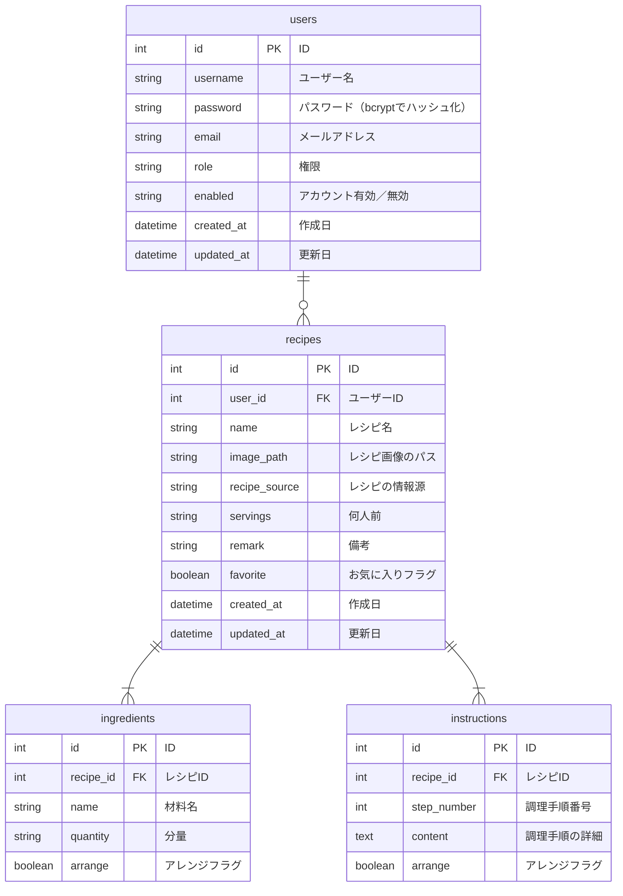

## はじめに

- 本リポジトリは、ポートフォリオとして作成したCRUDアプリ（料理のレシピを管理できるアプリ）に関するものです。

[//]: # (TODO：構成を見直してスリム化、今後の対応事項はISSUEへ。詳細事項はwikiへ。)

## 作成背景

### 課題

- 料理するとき、参考にしたいレシピの掲載媒体がバラバラで探しづらい
- レシピをアレンジした材料や調理手順を記録に残しづらい

### 経緯

- 私は家庭で料理を担当しており、レシピサイトやYouTube、レシピ本などの様々な媒体を参考にしつつ、私や妻の好みに合わせてアレンジしながら料理を作っています。
- ただ、料理する際に「違う媒体を見かえすのが面倒」「どうアレンジしたか忘れた」「今ある材料から作れるレシピを思い出せない」などの不便さを感じていました。
- また、10月に子供が生まれ、これまで以上に効率的に料理をこなす必要が出てきました。
- そこで、これまで作ってきた料理レシピをノートのように集約し、見返しやすいアプリケーションを作ることにしました。

### 業務フロー

## アプリケーションの概要

- 本アプリ「RecipeNotebook」は、自分だけのレシピノートを作成・管理するためのアプリケーションです。
- 昔、母親が作っていた手書きのレシピノートを参考に、シンプルかつ直感的に使えるようにしつつ、Webアプリの特性を活かした機能を実装しました。
- 主な機能は、以下の通りです。
    - 登録済みのユーザーによるログインおよびゲストログイン
    - レシピの一覧表示・詳細情報閲覧・検索
    - レシピの新規作成・編集・削除
- ユーザー管理機能は現時点で実装していません。

## 使用方法

#### デモ動画

https://github.com/user-attachments/assets/ec2c19dc-83a0-46f4-8b99-43bcc10d6b76

#### 詳細

https://github.com/YaraiM/RecipeNotebook/wiki/How-to-Use-RecipeNotebook
GitHub Wikiにまとめておりますので、ご覧ください。

## 主な使用技術

#### バックエンド

- Java Oracle OpenJDK 21.0.3
- Spring Boot 3.3.4
- Spring Security 6.3.3

#### フロントエンド

- HTML/CSS/JavaScript
- Bootstrap 5.1.3

#### データベース・インフラ

- MySQL 8.0.39
- Amazon Web Service

#### その他

- バージョン管理：Git, GitHub
- CI/CD：GitHub Actions
- テスト：JUnit 5.10.3
- O/Rマッパー：MyBatis 3.0.3
- DB環境構築（開発時）：Docker, Docker Compose

## 設計書

#### API仕様書

https://yaraim.github.io/RecipeNotebook/

#### E-R図

#### URL一覧

#### 画面遷移図

#### インフラ構成図

## 工夫した点と課題

#### バックエンドとフロントエンドの分離

- バックエンドはREST
  APIを提供し、フロントエンドはAPIを呼び出して画面表示するよう設計しています。例外処理もバックエンドが行い、フロントエンドは基本的にバックエンドから受け取ったエラーメッセージを表示する役割のみとしています。
- 責任範囲を分離することで、▽不具合のポイントを明確にする、▽仕様変更を容易にする、▽APIの再利用性を高める――などのメリットを得ることを狙いました。
- ただ、Spring
  Securityを導入した際にフォームログインとCSRFトークンによるセッションベースの認証としたため、ステートフルな構造になり、これらのメリットが薄まってしまいました。これはセッション管理に関する知識不足が原因であり、大きな反省点です。
- フロントエンドはしっかり学習できずTypeScriptも使用していないため、洗練されていないと感じています。特にJSファイルは可読性が悪く、XSS対策もできていません。ここも今後の課題です。
- また、フロントエンドを実装する過程でバックエンドに足りない機能があることに気づくことも多く、要件定義が甘かったことを痛感しました。詳細設計までしっかり行うべきだったと思います。
- とはいえ、UIを意識することが円滑なバックエンド開発に貢献しうることを学べたので、フロントに取り組んだことは結果的によかったと考えています。
- 私はバックエンドエンジニアを目指していますが、ユーザーフレンドリーなアプリケーションに必要な開発ができるよう、バックエンドと並行してフロントエンドの学習も進めたいと思います。

#### 機能開発ごとの自動テスト実装およびCIの導入

- 機能を実装したら都度、自動テストも作るよう心掛けました。 また、GitHub Actionsを使用したCIも導入しています。
- テストを後回しにしなかったことで、バグや想定しない動作を早期発見できました。
- 厳密な検証を行うテストコードが多いため、コード修正時にテスト失敗となるケースが多く、修正が大変でした。テスト容易性は今後の課題と考えています。

#### 画像ファイルのアップロード機能

- 画像ファイルをアップロードできるようにしました。ホームディレクトリに画像アップロード用のディレクトリを作成して画像を保存し、そのパスをレシピに登録して紐づけています。
- フロントエンド側で画像ファイルをBase64にエンコードし、JSON形式で渡して、バックエンド側でファイルサイズやデータ形式のチェックを行います。
- Base64によりテキストデータとしてファイルを扱える方が例外等を制御しやすいと考え、このような実装にしました。
- Base64を使ったことによるファイルサイズ増加とパフォーマンス低下が課題です。今後はmultipart/form-dataによるデータ転送を検討します。
- 現バージョンはEC2に画像をアップロードしていますが、スケーラビリティの観点から、画像ファイルはS3にアップロードすることも考慮したいと思います。

#### レシピの更新処理

- ▽既存情報を更新、▽材料・調理手順の一部追加・削除、▽既存の画像ファイルを削除して新規ファイルを登録――など、様々なケースを考えなければならず、実装に工夫が必要でした。
- 一つ一つの処理を実装するたびに動作テストをして、わからなければ調べて・・・を繰り返して、想定どおりの動作を実現できました。

## 今後の展望

#### 追加機能

- ユーザーの管理機能
- タグ（料理のカテゴリなど）を作成してレシピに付与できる機能
- レシピの栄養成分（PFC、食塩量、野菜量）の計算を補助する機能
- ユーザー同士でレシピをシェアする機能（シェアレシピの閲覧ページやSNS連携の実装など）

#### 改善点

- ステートレスな設計への変更（JWT認証の導入など）
- フロントエンドの可読性向上とXSS対策
- ファイルアップロード時のデータ転送方法の見直し
- 画像アップロード先をクラウドストレージ（S3等）に変更
- テスト容易性の向上

## おわりに

- ポートフォリオの作成を通じて、これまでスクールで学んだ内容をアウトプットする良い機会となりました。
  未知の機能は自分で調べながら実装したため、開発を自走する練習になったと思います。
- 至らない部分はあるものの、「こういうアプリがあったらいいのに」という問題意識を起点にゼロからアプリを形にできたことは自信につながりました。引き続き技術をキャッチアップして学習を続けたいと思います。