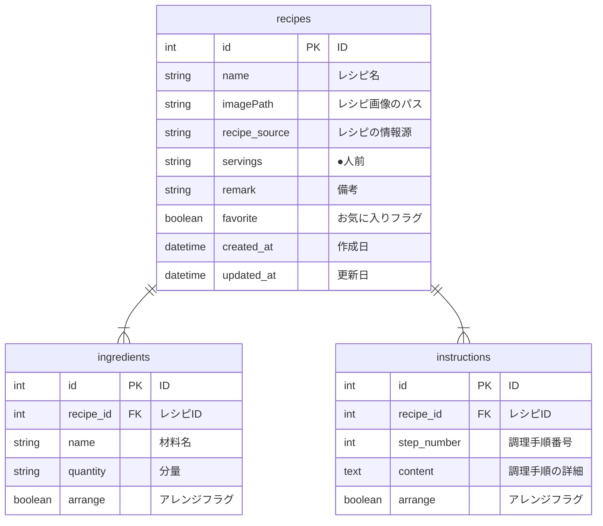

## はじめに

- 本リポジトリは、Java学習者の私がポートフォリオとして作成したCRUDアプリ「RecipeNotebook」に関するものです。
- スクールや独学で学んだ成果として、一から実用的なサービスを作ることを目指しました。

## 作成背景

- 私の家庭では私が料理を担当しており、レシピサイトやYouTube、レシピ本などの様々な媒体を参考にしつつ、私や妻の好みに合わせてアレンジしながら料理を作っています。
- ただ、料理する際に「違う媒体を見かえすのが面倒」「どうアレンジしたか思い出せない」「今ある材料から作れるレシピを思い出せない」などの不便さを感じていました。
- また、10月に子供が生まれ、料理に割ける時間を少しでも短くする必要が出てきました。
- そこで、これまで作ってきたレシピをノートのように集約し、見返しやすいアプリケーションを作ることにしました。

## アプリケーションの概要

- 本アプリ「RecipeNotebook」は、自分だけのレシピノートを作成・管理するためのアプリケーションです。
- 昔、母親が作っていた手書きのレシピノートを参考に、シンプルかつ直感的に使えるようにしつつ、Webアプリの特性を活かした機能を実装しました。
- 主な機能は、以下の通りです。
    - ユーザーのログイン機能
    - レシピの一覧表示・詳細情報閲覧・検索
    - レシピの新規作成・編集・削除

## 使用方法

### デモ動画

https://github.com/user-attachments/assets/442a66ad-3658-4f75-b537-69c318ee8e12

### ログイン画面

- IDとパスワードを入力してログインすると、レシピ一覧画面に遷移します。
- 入力を間違えると、エラーメッセージが表示されます。

### レシピ一覧・詳細画面

- 作成したレシピの一覧がカード形式で表示されます。カードをクリックするとレシピ詳細画面に遷移します。
- 上部の検索フォームで、▽レシピ／材料名でのキーワード検索、▽お気に入りレシピの検索、作成・更新日での範囲検索を行えます。
- その他、各ボタンの機能は以下の通りです。
    - 新規作成ボタン：新規作成フォームへ遷移
    - ★マーク：お気に入り登録・解除
    - ✎マーク：編集画面に遷移
    - ×マーク：レシピの削除

### 新規作成・編集画面

- フォームに入力した情報に基づき、レシピの新規作成・編集を行えます。
- 編集フォームには、登録済みのレシピ情報があらかじめ入力されています。
- 必須項目の未入力、画像以外のデータのアップロードなどを行うとエラーが発生し、登録が行われません。

## 主な使用技術

- バックエンド
    - Java Oracle OpenJDK 21.0.3
    - SpringBoot 3.3.4
    - JUnit 5.10.3

- フロントエンド
    - HTML/CSS/JavaScript
    - Bootstrap 5.1.3

- データベース・インフラ
    - MySQL 8.0.39
    - Docker
    - Amazon Web Service

- その他
    - バージョン管理：Git, GitHub
    - CI/CD：GitHub Actions

## 設計書

### E-R図

### API仕様書

※準備中です。

### URL一覧

### 画面遷移図

### インフラ構成図

※準備中です。

## 工夫した点と課題

### バックエンドとフロントエンドの分離

- バックエンドはREST
  APIを提供し、フロントエンドはAPIの呼び出しや画面表示を行います。バリデーションもバックエンドが行い、フロントエンドではバックエンドから受け取ったエラーメッセージを表示するよう設計しています。
- 役割を分離し、バックエンド、フロントエンドともに将来の機能拡張を容易にすることが狙いです。
- 結果、コード全体が複雑になったことが反省点です。特にフロントエンドは体系的に学習しなかったため、画面上でアプリが動作するまでにかなり時間を費やした割に、可読性がよくありません。
- 私はバックエンドエンジニアを目指していますが、ユーザーフレンドリーなアプリケーション開発ができるよう、今後はフロントエンド側の学習も進めたいと思います。

### 機能開発ごとの自動テスト実装およびCIの導入

- 機能を実装したら都度、自動テストを実装するよう心掛けました。 また、GitHub Actionsを使用したCIも導入しています。
- これにより、バグや想定しない動作を早期発見できるようにしました。
- 厳密な検証を行うテストコードが多いため、コード修正時にテスト失敗となるケースが多く、大変でした。テスト容易性は今後の課題と考えています。

### 画像ファイルのアップロード機能

- 画像ファイルをアップロードできるようにしました。ホームディレクトリに画像アップロード用のディレクトリを作成し、画像を保存します。保存した画像へのパスをレシピに登録し、紐づけています。
- フロントエンド側で画像ファイルをBase64にエンコードし、JSON形式で渡すことで、バックエンド側でファイルサイズやデータ形式のチェックを行います。
- Base64のエンコード／デコードによるファイルサイズの増加とパフォーマンスの低下が課題です。今後はmultipart/form-dataによるデータ転送を検討します。

### SpringSecurityの導入

- SpringSecurityを使ってログイン認証とCSRF対策を有効化しています。
- DBに変更を加える操作を行う際は、バックエンド側からCSRFトークンを取得し、フロントエンド側でトークンを呼び出してヘッダー情報として付加しています。
- ユーザーの管理機能を実装しておらず、管理者やユーザーごとに操作権限（認可）を分けるところまでは実装できていません。これは今後の課題です。

## 今後の展望

### 追加したい機能

- ユーザー管理機能
- タグ（料理のカテゴリなど）を作成してレシピに付与できる機能
- レシピの栄養成分（PFC、食塩量、野菜量）の計算を補助する機能

### 改善したい点

- コード全体の可読性向上
- ファイルアップロード時のデータ転送方法の見直し
- HTTPSによる通信暗号化
- テスト容易性の向上

## おわりに

- ポートフォリオの作成を通じて、これまでスクールで学んだ内容をアウトプットする良い機会となりました。
  未知の機能は自分で調べながら実装したため、開発を自走する練習になったと思います。
- 反省点はたくさんありますが、一番は要件定義やスケジュールの見通しが甘かったことです。いざ開発を始めると、当初の要件定義で想定していない事項が出てきて、何度も手戻りが発生しました。
- その結果、当初は企画から開発完了まで1か月半くらいを見込んでいたところ、実際には2か月半（合計180 ~
  190時間程度）かかりました。最初の要件定義がいかに大事か、身に染みてよくわかりました・・・
- 至らない部分はあるものの、ゼロからアプリケーションを作り、形にできたことは自信につながりました。引き続き、技術のキャッチアップを怠ることなく学習を続けたいと思います。