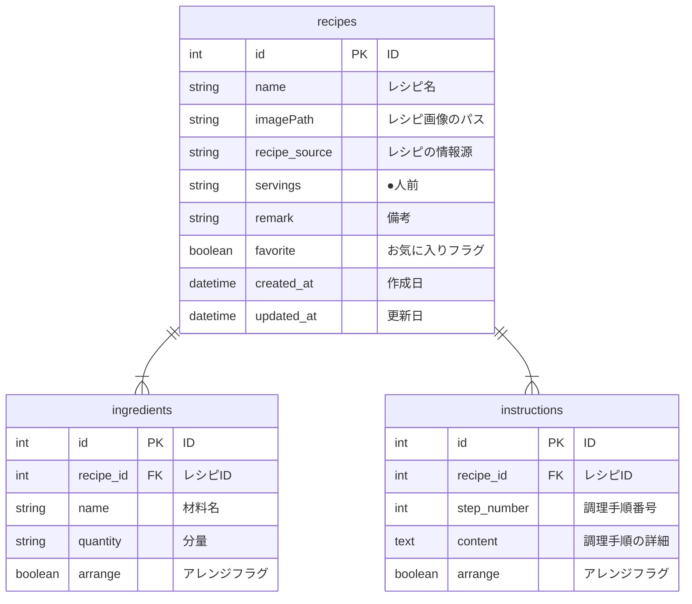

# RecipeNotebook

## アプリケーションの概要

## 作成背景

## 主な使用技術

## 設計書

### E-R図

```mermaid
---
title: ""
---
erDiagram
    recipes ||--|{ ingredients: ""
    recipes ||--|{ instructions: ""

    recipes {
        int id PK "ID"
        string name "レシピ名"
        string imagePath "レシピ画像のパス"
        string recipe_source "レシピの情報源"
        string servings "●人前"
        string remark "備考"
        boolean favorite "お気に入りフラグ"
        datetime created_at "作成日"
        datetime updated_at "更新日"
    }

    ingredients {
        int id PK "ID"
        int recipe_id FK "レシピID"
        string name "材料名"
        string quantity "分量"
        boolean arrange "アレンジフラグ"
    }

    instructions {
        int id PK "ID"
        int recipe_id FK "レシピID"
        int step_number "調理手順番号"
        text content "調理手順の詳細"
        boolean arrange "アレンジフラグ"
    }
```

### URL一覧

### 画面遷移図

### インフラ構成図

## 使用イメージ

## 工夫・苦労した点

## 今後の展望