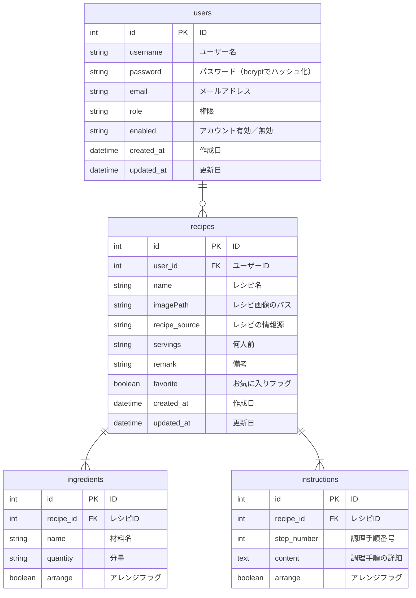

## はじめに

- 本リポジトリは、Java学習者の私がポートフォリオとして作成したCRUDアプリ「RecipeNotebook」に関するものです。
- スクールや独学で学んだ成果として、一から実用的なサービスを作ることを目指しました。

## 作成背景

- 私の家庭では私が料理を担当しており、レシピサイトやYouTube、レシピ本などの様々な媒体を参考にしつつ、私や妻の好みに合わせてアレンジしながら料理を作っています。
- ただ、料理する際に「違う媒体を見かえすのが面倒」「どうアレンジしたか思い出せない」「今ある材料から作れるレシピを思い出せない」などの不便さを感じていました。
- また、10月に子供が生まれ、これまで以上に効率的に料理をこなす必要が出てきました。
- そこで、これまで作ってきたレシピをノートのように集約し、見返しやすいアプリケーションを作ることにしました。

## アプリケーションの概要

- 本アプリ「RecipeNotebook」は、自分だけのレシピノートを作成・管理するためのアプリケーションです。
- 昔、母親が作っていた手書きのレシピノートを参考に、シンプルかつ直感的に使えるようにしつつ、Webアプリの特性を活かした機能を実装しました。
- 主な機能は、以下の通りです。
    - 登録済みのユーザーによるログインおよびゲストログイン
    - レシピの一覧表示・詳細情報閲覧・検索
    - レシピの新規作成・編集・削除
- ユーザー管理機能は現時点で実装していません。

## 使用方法

#### デモ動画

https://github.com/user-attachments/assets/ec2c19dc-83a0-46f4-8b99-43bcc10d6b76

#### ログイン画面

- IDとパスワードを入力してログインすると、レシピ一覧画面に遷移します。
- 入力を間違えると、エラーメッセージが表示されます。
- 現バージョンではゲストログインを可能としています。

#### レシピ一覧・詳細画面

- 作成したレシピの一覧がカード形式で表示されます。カードをクリックするとレシピ詳細画面に遷移します。
- 上部の検索フォームで、▽レシピ／材料名でのキーワード検索、▽お気に入りレシピの検索、作成・更新日での範囲検索を行えます。
- その他、各ボタンの機能は以下の通りです。
    - 新規作成ボタン：新規作成フォームへ遷移
    - ★マーク：お気に入り登録・解除
    - ✎マーク：編集画面に遷移
    - ×マーク：レシピの削除

#### 新規作成・編集画面

- フォームに入力した情報に基づき、レシピの新規作成・編集を行えます。
- 編集フォームには、登録済みのレシピ情報があらかじめ入力されています。
- 必須項目の未入力、画像以外のデータのアップロードなどを行うとエラーが発生し、登録が行われません。

## 主な使用技術

#### バックエンド

- Java Oracle OpenJDK 21.0.3
- Spring Boot 3.3.4
- Spring Security 6.3.3

#### フロントエンド

- HTML/CSS/JavaScript
- Bootstrap 5.1.3

#### データベース・インフラ

- MySQL 8.0.39
- Amazon Web Service

#### その他

- バージョン管理：Git, GitHub
- CI/CD：GitHub Actions
- テスト：JUnit 5.10.3
- O/Rマッパー：MyBatis 3.0.3
- DB環境構築（開発時）：Docker, Docker Compose

## 設計書

#### API仕様書

https://yaraim.github.io/RecipeNotebook/

#### E-R図

#### URL一覧

#### 画面遷移図

#### インフラ構成図

## 工夫した点と課題

#### バックエンドとフロントエンドの分離

- バックエンドはREST
  APIを提供し、フロントエンドはAPIの呼び出しや画面表示を行います。例外処理も基本的にバックエンドが行い、フロントエンドはバックエンドから受け取ったエラーメッセージを表示するよう設計しています。
- 役割を分離し、バックエンド、フロントエンドともに拡張性を高めることが狙いです。
- フロントエンドを体系的に学習せず、TypeScriptやReactなども使用しなかったことで、洗練された実装になっていないと感じています。可読性がよくないことも課題です。
- また、フロントエンドを実装する過程でバックエンドに足りない機能があることに気づくことが多く、事前の要件定義が甘かったことを痛感しました。
- ただ、UIを意識することが円滑なバックエンド開発に貢献しうることを学べたので、フロントに取り組んだことは結果的によかったと考えています。
- 私はバックエンドエンジニアを目指していますが、ユーザーフレンドリーなアプリケーションに必要な開発ができるよう、バックエンドと並行してフロントエンドの学習も進めたいと思います。

#### 機能開発ごとの自動テスト実装およびCIの導入

- 機能を実装したら都度、自動テストも作るよう心掛けました。 また、GitHub Actionsを使用したCIも導入しています。
- テストを後回しにしなかったことで、バグや想定しない動作を早期発見できるようにしました。
- 厳密な検証を行うテストコードが多いため、コード修正時にテスト失敗となるケースが多く、大変でした。テスト容易性は今後の課題と考えています。

#### 画像ファイルのアップロード機能

- 画像ファイルをアップロードできるようにしました。ホームディレクトリに画像アップロード用のディレクトリを作成し、画像を保存します。保存した画像へのパスをレシピに登録し、紐づけています。
- フロントエンド側で画像ファイルをBase64にエンコードし、JSON形式で渡して、バックエンド側でファイルサイズやデータ形式のチェックを行います。
- Base64によりテキストデータとしてファイルを扱える方が例外等を制御しやすいと考え、このような実装にしました。
- Base64を使ったことによるファイルサイズ増加とパフォーマンス低下が課題です。今後はmultipart/form-dataによるデータ転送を検討します。
- 現バージョンはEC2に画像をアップロードしていますが、スケーラビリティの観点から、画像ファイルはS3にアップロードすることも考慮したいと思います。

#### レシピの更新処理

- ▽既存情報を更新、▽材料・調理手順の一部追加・削除、▽既存の画像ファイルを削除して新規ファイルを登録――など、様々なケースを考えなければならず、実装に工夫が必要でした。
- 一つ一つの処理を実装するたびに動作テストをして、わからなければ調べて・・・を繰り返して、想定どおりの動作を実現できました。

## 今後の展望

#### 追加機能

- ユーザーの管理機能
- タグ（料理のカテゴリなど）を作成してレシピに付与できる機能
- レシピの栄養成分（PFC、食塩量、野菜量）の計算を補助する機能

#### 改善点

- コード全体の可読性向上
- ファイルアップロード時のデータ転送方法の見直し
- 画像アップロード先をクラウドストレージ（S3等）に変更
- テスト容易性の向上

## おわりに

- ポートフォリオの作成を通じて、これまでスクールで学んだ内容をアウトプットする良い機会となりました。
  未知の機能は自分で調べながら実装したため、開発を自走する練習になったと思います。
- 至らない部分はあるものの、ゼロからアプリケーションを作り、形にできたことは自信につながりました。引き続き、技術のキャッチアップを怠ることなく学習を続けたいと思います。